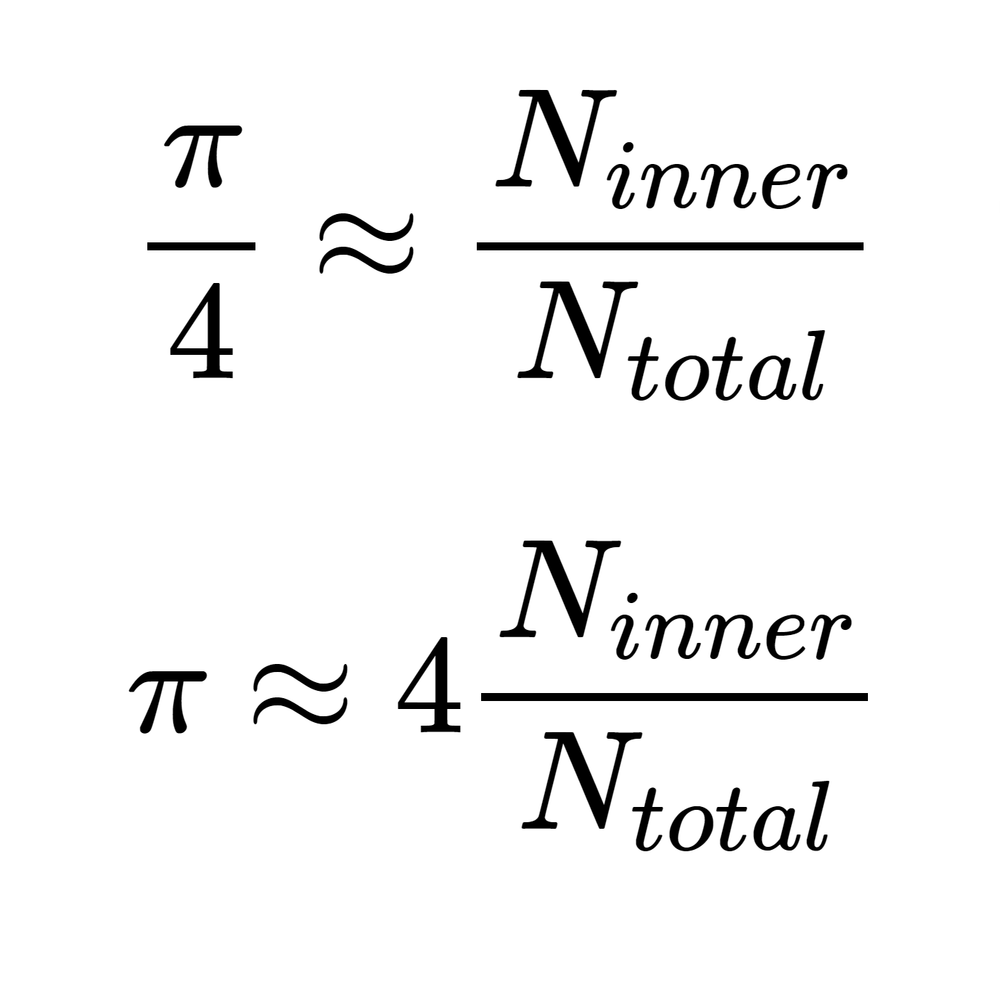

# Pi Day

## Problem Statement

In today's lab you will be tasked with calculating the value of Pi! There are many different ways out there to calculate the value of Pi out there, however, one of my favorites is the Monte Carlo method.

In the demo shown in class, we have a circle of radius 0.5, enclosed by a 1 × 1 square. The area of the circle is `πr^2=π/4`, the area of the square is `1`. If we divide the area of the circle, by the area of the square we get `π/4`.

We then generate a large number of uniformly distributed random points and plot them on the graph. These points can be in any position within the square i.e. between (0,0) and (1,1). If they fall within the circle, they are coloured green, otherwise they are coloured red. We keep track of the total number of points, and the number of points that are inside the circle. If we divide the number of points within the circle by the total number of points we should get a value that is an approximation of the ratio of the areas we calculated above, `π/4`.

In other words,



Now that we have iteration, we have all the tools needed to run this simulation ourselves!

Recall from lesson 6 that `Math.random()` returns a random number between 0, and 1. Other `Math` class methods you will need to know are `Math.pow(b, e)` and `Math.sqrt(x)`.

To test how close you can make estimate the value of PI, you should allow the user to enter the number of iterations you will run the simulation.

After you have run the simulation and counted the number of hits inside the circle, divide the number inside of the circle by the total number of iterations, and multiply by 4. This should be your estimate of Pi!

## Input Description

The only input will be a single positive integer representing the number of iterations in your simulation.

## Sample Input/Output

```
How many iterations would you like to run? 10
I estimate Pi is: 3.2
```

```
How many iterations would you like to run? 100
I estimate Pi is: 3.32
```

```
How many iterations would you like to run? 1000
I estimate Pi is: 3.116
```

```
How many iterations would you like to run? 10000
I estimate Pi is: 3.1172
```

```
How many iterations would you like to run? 100000
I estimate Pi is: 3.1396
```

* Note that the simulation is random and your output will vary slightly from mine.

## Submission

Please submit the following to google classroom:

1. `Main.java`
    * Hover over `Main.java`.
    * Click the three dots to the right of the file name.
    * Click `Download`.
    * Upload the downloaded file to google classroom.
2. A link to your replit project

## Rubric

<table>
<tbody>
  <tr>
    <td valign="top"><b>Coded Solution</b><br><br>The coded solutions works correctly with no syntax, logic, or run-time errors.</td>
    <td valign="top"><b>8pts</b><br><br>* The submitted code compiles successfully. <br><br>* The submitted program is free of run-time and logic errors. <br><br>* The submitted program returns the anticipated output for all input tested.
</td>
    <td valign="top"><b>4pts</b><br><br>* The submitted program compiles successfully. <br><br>* The submitted program includes run-time and/or logic errors that result in correct output. <br><br>* The submitted program returns the anticipated output for most (but not all) input tested.
</td>
    <td valign="top"><b>2pts</b><br><br>* A program is submitted but it fails to compile. <br><br><b><em>or</em></b> <br><br>* The submitted program compiles correctly. <br><br>* The submitted program includes run-time and/or logic errors that result in incorrect output. <br><br>* The submitted program returns the anticipated output for less than half of the input tested.
</td>
    <td valign="top"><b>0pts</b><br><br>* A program solution is not submitted.
</td>
  </tr>
  <tr>
    <td valign="top"><b>Target Concepts</b><br><br>The program effectively uses the intended target concepts.</td>
    <td valign="top"><b>8pts</b><br><br>* The program effectively uses the target concepts being discussed in class or outlined within the project specifications for the given problem situation.
</td>
    <td valign="top"><b>4pts</b><br><br>* The program incorrectly uses the target concepts being discussed in class or outlined within the project specifications for the given problem situation. <br><br>* Moderate effort to use the target concepts is evident.
</td>
    <td valign="top"><b>2pts</b><br><br>* The program incorrectly uses the target concepts being discussed in class or outlined within the project specifications for the given problem situation. <br><br>* Minimal effort to use the target concepts is evident.
</td>
    <td valign="top"><b>0pts</b><br><br>* A program solution is not submitted. <br><br><b><em>or</em></b><br><br> * No attempt was made to use the target concepts being discussed in class or outlined within the project specifications for the given problem situation.
</td>
  </tr>
  <tr>
    <td valign="top"><b>User Interface</b><br><br>The program produces output that is easy for the user to read.</td>
    <td valign="top"><b>2pts</b><br><br>* Output demonstrates appropriate spacing for best user readability. <br><br>* Output contains no spelling or grammatical errors.
</td>
    <td valign="top"><b>1pts</b><br><br>* Output includes minor spacing problems which results in information which is inconsistent or confusing. <br><br>* Output contains minor spelling or grammatical errors.
</td>
    <td valign="top"><b>0pts</b><br><br>* A program solution is not submitted. <br><br><b><em>or</em></b> <br><br>* Output includes major spacing problems which is severely inconsistent or confusing. <br><br>* Output contains major spelling or grammatical errors.
</td>
  </tr>
  <tr>
    <td valign="top"><b>Readability of Code</b><br><br>The program code is documented and formatted for human readability.</td>
    <td valign="top"><b>2pts</b><br><br>* The submitted solution includes the required header documentation (name, date, purpose). <br><br>* Header documentation includes appropriate modification comments if the submitted solution is a modification to a previously submitted program. <br><br>* Code is properly formatted. Open and close brackets are properly aligned and code within the brackets is appropriately indented. <br><br>* All variables are self-documented (i.e. named in such a way that the name indicates the purpose of the variable).
</td>
    <td valign="top"><b>1pts</b><br><br>* The submitted solution includes the some, but not ALL, of the required header documentation (name, date, purpose). <br><br>* In the case of modifications to a previously submitted program, modification comments are missing or incomplete. <br><br>* Code is unformatted and difficult to follow. Brackets aren't aligned and/or code within brackets is not indented. <br><br>* Numerous variable names are ambiguous (i.e. x) and do not indicate the purpose of the variable.
</td>
    <td valign="top"><b>0pts</b><br><br>* A program solution is not submitted. <br><br><b><em>or</em></b> <br><br>* The submitted solution includes no documentation of any kind.</td>
  </tr>
</tbody>
</table>
